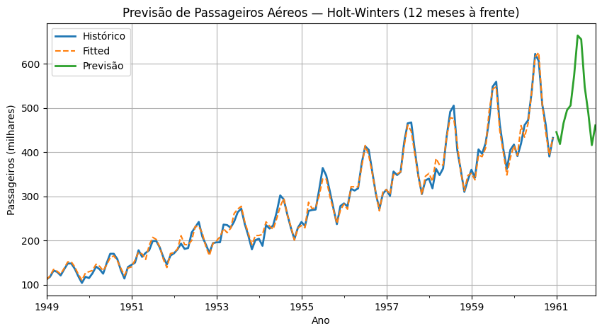

# previsao-holt-winters-airpassengers

# ✈️ Previsão de Passageiros Aéreos com Holt-Winters

Este projeto demonstra a aplicação do modelo **Holt-Winters (Suavização Exponencial Tripla)** para previsão de séries temporais em Python.  
O dataset **AirPassengers (1949–1960)** é um conjunto **simples, mas eficiente** — ideal para demonstrar o uso do método em dados reais, com tendência de crescimento e clara sazonalidade anual.  
Apesar de compacto, ele permite visualizar de forma clara como o modelo aprende e projeta padrões sazonais e de tendência ao longo do tempo.

---

## 🧩 Etapas do Projeto
1. **Exploração e limpeza dos dados**  
   - Dataset público de passageiros aéreos (mensal).  
   - Conversão da coluna de datas para índice temporal (`DatetimeIndex`).  
   - Frequência mensal garantida (`MS`).

2. **Divisão temporal (treino/validação)**  
   - 12 últimos meses separados para validação (1 ciclo sazonal completo).

3. **Busca de hiperparâmetros (grid search)**  
   - Foram testadas combinações de:
     - Tendência: `aditiva` e `multiplicativa`
     - Sazonalidade: `aditiva` e `multiplicativa`
     - Período sazonal: 12 meses  
   - A métrica usada foi o **MAPE (Mean Absolute Percentage Error)**.

4. **Treinamento final e previsão (12 meses à frente)**  
   - O modelo final foi ajustado com **toda a série histórica**.  
   - Foram projetados **12 meses futuros**, mantendo a estrutura sazonal e a tendência aprendida.

---

## 🧠 Resultados

| Parâmetro | Valor escolhido |
|------------|-----------------|
| `trend` | `add` (tendência aditiva) |
| `seasonal` | `mul` (sazonalidade multiplicativa) |
| `seasonal_periods` | `12` |
| **MAPE (validação)** | **2.21%** |
| **RMSE (validação)** | **15.81** |

O modelo final apresentou **excelente desempenho**, com erro médio percentual de apenas **2,21%**.  
A tendência aditiva e a sazonalidade multiplicativa capturaram de forma precisa o crescimento da série e a variação sazonal proporcional ao nível de passageiros.

---

## 📈 Visualização do Resultado


O gráfico mostra:
- **Histórico** (linha azul) — série original  
- **Fitted** (tracejada) — ajuste do modelo aos dados  
- **Previsão** (laranja) — projeção de 12 meses sem “buraco” entre histórico e forecast  

---

## 📂 Estrutura do Projeto
```
📦 previsao-holt-winters-airpassengers 
┣ 📜 holt_winters_airpassengers_portfolio.ipynb
┣ 📂 outputs
┃ ┣ previsao_airpassengers.csv
┃ ┣ melhor_config_airpassengers.json
┃ ┗ holt_winters_airpassengers.png
┗ 📜 README.md
```
---

## 🛠️ Tecnologias Utilizadas
- Python 3.10+
- pandas
- matplotlib
- statsmodels (ExponentialSmoothing)

---

## ✨ Autor
**Clara Delboni**  
Engenheira de Produção | Pós-graduada em Ciência de Dados e Analytics  
📍 Niterói, RJ  
💼 [LinkedIn](https://www.linkedin.com/in/clara-delboni/) | 🐙 [GitHub](https://github.com/claradelboni)


